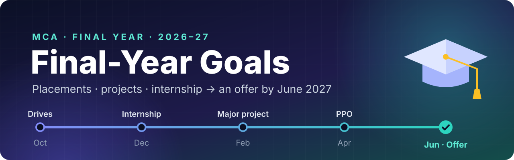

  

  <a href="#-right-now"><kbd>🚨 Right now</kbd></a>&nbsp;
  <a href="#-month-by-month"><kbd>📅 Month by month</kbd></a>&nbsp;
  <a href="#-pick-a-track"><kbd>🧭 Tracks</kbd></a>&nbsp;
  <a href="#-placement-readiness"><kbd>💼 Placement prep</kbd></a>&nbsp;
  <a href="#-projects-and-portfolio"><kbd>💻 Projects</kbd></a>&nbsp;
  <a href="#-other-paths"><kbd>🔀 Other paths</kbd></a>&nbsp;
  <a href="#-scoreboard"><kbd>📊 Scoreboard</kbd></a>

A roadmap for the final year of a 2-year MCA: **Sem 3** (Aug–Dec 2026) and **Sem 4** (Jan–Jun 2027). The goals and a timeline chart are on the [cover page](README.md).

> [!NOTE]
> **Plan A here is an offer for a chosen tech role before graduation.** If yours is M.Tech (GATE), teaching (UGC-NET), MS abroad or a government IT job, jump to [Other paths](#-other-paths) and reorder the priorities. Shift the dates to match your university's calendar.

## 🚨 Right now

> [!IMPORTANT]
> **Deadlines in early October 2026** (confirm them on the [official sites](#-key-dates-to-verify)):
> - **GATE 2027:** registration closes **5 Oct** (**12 Oct** with a late fee). Only if M.Tech or research is on the table.
> - **TCS NQT, October cycle:** registration reportedly closes **7 Oct**, with the test on 19 Oct.
> - **UGC-NET, December cycle:** notification expected in early October.

- [ ] Pick one target role and one backup (see [Pick a track](#-pick-a-track))
- [ ] Resume v1: one page, ATS-friendly, reviewed by two people (placement cell, a senior who got placed)
- [ ] Register with the placement cell for every eligible drive; check the usual cutoff (60% / 6.0 CGPA in 10th, 12th, UG and PG, no active backlogs)
- [ ] Register for TCS NQT, and for GATE / UGC-NET if they're part of your plan
- [ ] Start an application tracker (a spreadsheet): company · role · channel (campus / referral / portal) · date · stage · next step
- [ ] Start the daily habit: one DSA problem + 20 minutes of aptitude

## 📅 Month by month

### 🍂 October 2026 · set up and start applying
- [ ] Track chosen; resume v1 reviewed; LinkedIn and GitHub updated
- [ ] Registered for campus drives, TCS NQT and (if relevant) GATE / UGC-NET
- [ ] Daily DSA + aptitude habit running (~30 problems this month)
- [ ] Best existing project polished and deployed
- [ ] Three major-project ideas shortlisted and discussed with your guide
- [ ] Internship applications started

### 🎯 November 2026 · interview mode
- [ ] Weekly mock tests; two mock interviews
- [ ] New project MVP deployed
- [ ] CS fundamentals revised (OOP, DBMS, OS, networks)
- [ ] Major-project topic approved
- [ ] 10+ targeted off-campus applications and 5 referral requests

### 📝 December 2026 · exams and the internship
- [ ] Sem 3 exams cleared, no backlogs
- [ ] Internship confirmed for January
- [ ] ~100 DSA problems done; weak topics listed
- [ ] UGC-NET, if you're taking it

### 🚀 January–February 2027 · start strong
- [ ] A first useful contribution shipped at the internship within the first month
- [ ] Major project: requirements and design done; repo and weekly log started
- [ ] 3–4 hours a week kept for DSA and applications
- [ ] GATE, if you're taking it

### 📈 March–April 2027 · convert
- [ ] Asked your manager what a PPO depends on, and acted on it
- [ ] Major project feature-complete and tested; report being written
- [ ] ~200 DSA problems; resume v2 with internship results
- [ ] Off-campus applications continuing if there's no offer yet

### 🎓 May–June 2027 · finish and land
- [ ] Report submitted, viva done
- [ ] Offers compared (role, learning, pay, location, bond or service-agreement terms) and one accepted
- [ ] The company's tech stack picked up before joining
- [ ] No offer yet? Hiring doesn't stop at graduation: keep the weekly application routine, consider a paid internship or contract role that can convert, and keep shipping projects

## 🧭 Pick a track

> [!TIP]
> Choose **one primary track plus one adjacent backup** (e.g. backend + QA/SDET, or data analyst + ML). Everything else in this plan should serve that choice.

<b>🛠️ Backend / full-stack developer</b>

**Learn:** one language in depth (Java, Python or JavaScript/TypeScript), DSA, OOP, SQL with PostgreSQL or MySQL, REST APIs, one framework (Spring Boot, Django/FastAPI, or Node + React), Git, Linux, Docker, basic cloud deployment.

**Build:** an event/ticket booking app that handles concurrent bookings correctly (transactions or locking), with auth, Redis caching and background jobs, deployed with Docker.

<b>📊 Data analyst</b>

**Learn:** strong SQL, Excel, Python (pandas), statistics, Power BI or Tableau, and writing up insights.

**Build:** a dashboard plus a short written report on an open dataset (e.g. from data.gov.in) that answers a real question.

<b>🤖 ML / AI engineer</b>

**Learn:** Python, statistics, scikit-learn, PyTorch basics, LLM APIs, retrieval-augmented generation (RAG), embeddings and vector search, evaluation.

**Build:** an assistant over your syllabus, notes and previous papers that cites its sources, with a small test set to measure answer quality.

<b>☁️ Cloud / DevOps</b>

**Learn:** Linux, networking, Bash, Git, Docker, Kubernetes basics, CI/CD (GitHub Actions), Terraform, one cloud (AWS, Azure or GCP).

**Build:** take one of your apps and add CI/CD, infrastructure-as-code and monitoring (Prometheus/Grafana), deployed on a free tier, with a runbook.

<b>🧪 QA / SDET</b>

**Learn:** testing fundamentals, Java or Python, Selenium or Playwright, API testing (Postman, REST Assured), CI.

**Build:** an automated UI + API test suite for an open-source web app, running in CI with reports.

<b>🔐 Cybersecurity</b>

**Learn:** networking, Linux, web security (OWASP Top 10), Burp Suite, nmap, Wireshark, CTFs.

**Build:** write-ups of lab machines or CTFs, plus a small tool of your own (a log analyser or scanner).

## 💼 Placement readiness

### 🧮 Aptitude, for the online tests
- [ ] 20–30 minutes a day: quantitative aptitude, logical reasoning, verbal English
- [ ] One full mock a week in the pattern of your target companies (TCS NQT, Infosys, Wipro, Accenture, Cognizant, Capgemini, …)
- [ ] Pseudo-code, output-prediction and CS multiple-choice questions

> [!TIP]
> The online test is where most candidates are filtered out. At many service companies your score also sets your tier (TCS Ninja → Digital → Prime; Infosys Systems Engineer → Digital Specialist Engineer → Specialist Programmer). The higher tiers pay **roughly 2–3× more**, and they mostly test coding and DSA.

### 🧠 DSA, in one language
- [ ] Cover the patterns: arrays and strings, hashing, two pointers, sliding window, sorting and binary search, recursion and backtracking, linked lists, stacks and queues, trees and BSTs, heaps, graphs (BFS/DFS), greedy, basic DP
- [ ] Follow one sheet end to end, e.g. NeetCode 150, Striver's A2Z/SDE sheet, or LeetCode Top Interview 150
- [ ] ~100 problems by end of December, ~200 by end of March; re-solve the ones you got wrong
- [ ] From November, a timed contest every week or two (LeetCode, CodeChef)

### 📚 CS fundamentals, for the "core subjects" round
- [ ] **OOP:** the four pillars, interfaces vs abstract classes, SOLID basics, a few design patterns (Singleton, Factory, Observer)
- [ ] **DBMS and SQL:** keys, normalisation, joins, indexing, transactions and ACID; write queries by hand (e.g. LeetCode SQL 50)
- [ ] **Operating systems:** processes vs threads, scheduling, synchronisation, deadlocks, paging and virtual memory
- [ ] **Computer networks:** OSI and TCP/IP, TCP vs UDP, HTTP/HTTPS, DNS, "what happens when you type a URL"
- [ ] **Software engineering:** SDLC, Agile/Scrum, levels of testing, a Git workflow

### 🎤 Interviews
- [ ] A 60–90 second "tell me about yourself"
- [ ] A 2-minute walkthrough of each project: problem → your role → tech → hardest bug → result
- [ ] 3 mock technical interviews and 1 HR mock before your first big drive
- [ ] STAR stories ready: a conflict, a failure, a tight deadline, learning something fast
- [ ] Group discussion practice (some campus drives still have a GD round)

## 💻 Projects and portfolio

**A project counts when it:**
- 🎯 solves a real problem for real users (even 20 classmates) or with real data
- 🌍 is deployed, with a live link
- 📖 has a README with the problem, features, architecture diagram, setup steps and screenshots
- 🧪 has tests, CI and a sensible commit history
- 🗣️ is something you can explain decision by decision, without notes

**Goals:**
- [ ] Bring your best existing project up to that bar (October)
- [ ] Build one new project for your track (MVP by end of November)
- [ ] Make the major project your flagship (January–April)
- [ ] Optional: a few meaningful pull requests to an open-source tool you actually use

### 🎓 Major project (Sem 4)
- [ ] Pick a topic that fits your target role; get your guide's approval early
- [ ] Doing it at a company? Confirm what your university needs (NOC, internal guide, report format)
- [ ] Use Git from day one and keep a weekly progress log; it writes half the report and prepares you for the viva
- [ ] Follow the university's report format (SRS, design, testing, results) from the start, not in the last week
- [ ] A paper is optional; if you publish, choose a reputable peer-reviewed venue and avoid pay-to-publish journals

> [!CAUTION]
> Never buy or copy a project. Examiners and interviewers spot it quickly, and it's academic misconduct.

## 🤝 Internship → pre-placement offer

- [ ] From October, apply for January–June internships: placement cell, LinkedIn, Internshala, Wellfound (startups), company career pages, alumni referrals
- [ ] Have one confirmed by mid-December
- [ ] During it: ship something visible in the first month, ask for feedback every 2–3 weeks, document your work, and ask early what a PPO depends on
- [ ] Keep applying off-campus until you hold an offer you're happy with

## 📄 Resume, LinkedIn, GitHub

- [ ] **Resume:** one page, single column, plain layout (ATS-friendly), PDF. Sections: Education (with CGPA), Skills, Projects (links, tech, result), Internship, Achievements
- [ ] List only skills you can be questioned on
- [ ] Keep a base resume plus a variant per role; match keywords to the job description
- [ ] **LinkedIn:** headline with your target role, an About section, Featured projects; connect with alumni at target companies; post when you ship something
- [ ] **GitHub:** a profile README and 4–6 pinned repos with READMEs and live links
- [ ] Link a coding profile (LeetCode, CodeChef or HackerRank) once it's decent

> [!TIP]
> Write every resume bullet as action + what + measurable result, e.g. *"Cut API response time from 800 ms to 120 ms with Redis caching."*

## 🏫 Academics

> [!WARNING]
> Backlogs are a hard filter for most recruiters. Clear any pending ones in the next exam window.

- [ ] Keep at least 60% / 6.0 CGPA; some companies ask for 65–70%, so aim higher
- [ ] Protect the Sem 3 exams (Nov–Dec): block study weeks in advance instead of choosing between drives and exams
- [ ] Keep mark sheets, certificates and ID scanned in one folder; drives and joining formalities need them

## 📜 Certifications (optional)

Projects beat certificates; a certificate is a tie-breaker, not a substitute. One or two at most, and only if they match your track:

| Track | Certificate |
| --- | --- |
| Cloud / DevOps | AWS Cloud Practitioner → AWS Solutions Architect – Associate, or Azure AZ-900 → AZ-104 |
| Data | Microsoft PL-300 (Power BI Data Analyst) |
| Security | CompTIA Security+ |
| Any | NPTEL courses, if your university gives credit for them |

## 🤖 Working with AI

- [ ] Use AI coding assistants the way teams do (scaffolding, tests, docs, debugging), but make sure you can write and explain the code without them; online tests and interviews check exactly that
- [ ] Learn to build with LLM APIs: prompting, structured output, RAG, tool calling, and evaluating results; add one genuinely useful AI feature to a project if it fits your track
- [ ] Never ship code you can't explain

## 🔀 Other paths

| Path | What to know | When |
| --- | --- | --- |
| 🔬 **M.Tech / research** GATE CS 2027, run by IIT Madras | MCA eligibility for M.Tech varies by institute, and most PSU hiring through GATE needs a B.E./B.Tech, so check before counting on it | Register by **5 Oct 2026** (12 Oct with a late fee); exam on 6–7, 13–14 and 20–21 Feb 2027 |
| 📖 **Teaching / JRF** UGC-NET, Computer Science & Applications | Final-year PG students can apply; 55% in the master's is needed (50% for reserved categories) | Notification expected in early October; exam reportedly mid-December 2026 |
| ✈️ **MS abroad** | Shortlist universities, book IELTS/TOEFL (GRE where required), draft your SOP and line up 2–3 recommenders | Most US deadlines for Fall 2027: December 2026–January 2027 |
| 🏛️ **Government IT jobs** | Bank IT Officer (IBPS SO) and NIELIT/NIC Scientist-B; check each notification's eligibility | Varies; watch for notifications |

## 🔁 Weekly routine

About 15–20 hours a week outside classes:

| Day | Focus |
| --- | --- |
| **Mon–Fri** | 1 DSA problem (45–60 min) · aptitude (20–30 min) · project or skill work (30–60 min) |
| **Saturday** | Mock test or contest · 2–3 hours of project work · applications and networking (30 min) |
| **Sunday** | Review the week's mistakes · plan next week · rest |

## 📊 Scoreboard

Fill in at the end of each month.

| Month | DSA solved (total) | Mock tests | Applications | Interviews | Offers |
| --- | :-: | :-: | :-: | :-: | :-: |
| Oct 2026 | | | | | |
| Nov 2026 | | | | | |
| Dec 2026 | | | | | |
| Jan 2027 | | | | | |
| Feb 2027 | | | | | |
| Mar 2027 | | | | | |
| Apr 2027 | | | | | |
| May 2027 | | | | | |
| Jun 2027 | | | | | |

## 🚫 Mistakes to avoid

| ❌ Instead of | ✅ Do this |
| --- | --- |
| Collecting courses and certificates | Build things and apply |
| Spreading across four tracks | Go deep in one, with one backup |
| Skipping aptitude because it looks easy | Practise daily: it's where most candidates are filtered out |
| Waiting until you feel "ready" to apply | Apply while you prepare |
| Relying only on campus placements | Run off-campus applications and referrals in parallel |
| Letting AI write code you can't explain | Use AI, then make sure you can explain every line |
| Burning out | Sleep, exercise, and one lighter day a week |

## 📌 Key dates to verify

> [!NOTE]
> The dates in this plan were reported by news sites on 29 Sep 2026. Confirm them on the official site before acting: [GATE 2027](https://gate2027.iitm.ac.in/) · [UGC-NET](https://ugcnet.nta.ac.in/) · [TCS NQT](https://www.tcsion.com/hub/national-qualifier-test/it-career-readiness-pack/)

<a href="#">↑ Back to top</a>

