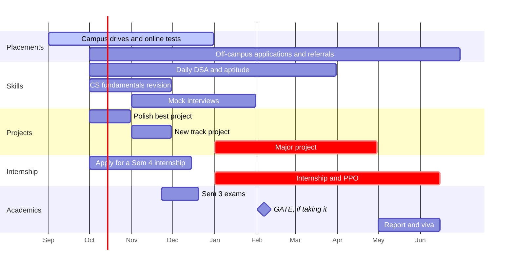

  

  
  
  

<h3 align="center">My roadmap for the final year of MCA: placements, projects, the internship, and an offer by June 2027.</h3>

  <a href="GOALS.md"><kbd>📋 Open the full plan</kbd></a>&nbsp;
  <a href="GOALS.md#-right-now"><kbd>🚨 Right now</kbd></a>&nbsp;
  <a href="GOALS.md#-scoreboard"><kbd>📊 Scoreboard</kbd></a>

## 🏁 The finish line

What June 2027 should look like:

| | Goal | What it means |
| :-: | --- | --- |
| 💼 | **An offer** | A role you chose, ideally a pre-placement offer (PPO) from the Sem 4 internship |
| 🎓 | **A clean degree** | No backlogs, CGPA above cutoffs, a strong major project and viva |
| 💻 | **Proof of work** | 2–3 deployed projects plus the major project, with proper READMEs |
| 🧠 | **Interview-ready** | DSA to medium level, CS fundamentals, every project decision explainable |
| 🌐 | **Visible** | Resume, LinkedIn and GitHub tell the same story, and alumni know what you're looking for |

## 📅 Year at a glance

## 🧭 Inside the plan

| | Section | What's there |
| :-: | --- | --- |
| 🚨 | [Right now](GOALS.md#-right-now) | Deadlines and first steps for early October |
| 📅 | [Month by month](GOALS.md#-month-by-month) | Checklists from October to June |
| 🧭 | [Pick a track](GOALS.md#-pick-a-track) | Skills and a flagship project for six roles |
| 💼 | [Placement readiness](GOALS.md#-placement-readiness) | Aptitude, DSA, CS fundamentals and interviews |
| 💻 | [Projects and portfolio](GOALS.md#-projects-and-portfolio) | What makes a project count, and the major project |
| 🤝 | [Internship → PPO](GOALS.md#-internship--pre-placement-offer) | Turning Sem 4 into an offer |
| 📄 | [Resume, LinkedIn, GitHub](GOALS.md#-resume-linkedin-github) | Getting noticed |
| 🔀 | [Other paths](GOALS.md#-other-paths) | GATE, UGC-NET, MS abroad, government IT jobs |
| 📊 | [Scoreboard](GOALS.md#-scoreboard) | Monthly numbers to fill in |

## 📝 How to use this

- **Tick a box:** open [GOALS.md](GOALS.md), click the pencil icon (Edit), change `- [ ]` to `- [x]`, and commit.
- **End of each month:** fill in the [scoreboard](GOALS.md#-scoreboard) and read the next month's list.
- **Dates move:** shift them to match your university's calendar.
